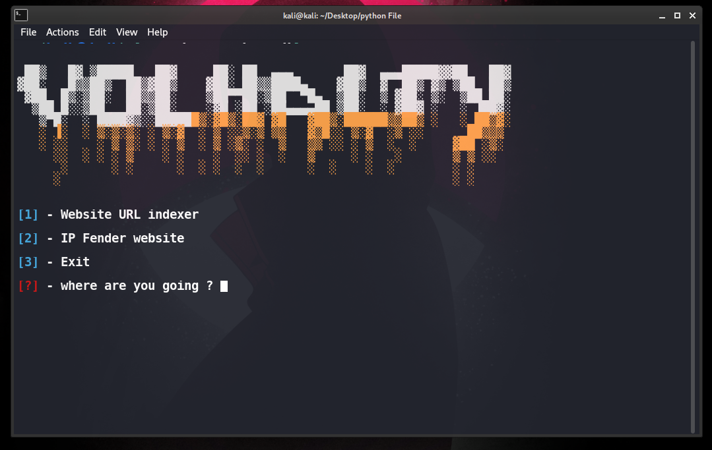

# URL-index-and-website-IP
This tool consists of two parts, the first one gets the website address and extracts all the URLs in the html document, and the second part is for converting the website to IP. !! 

